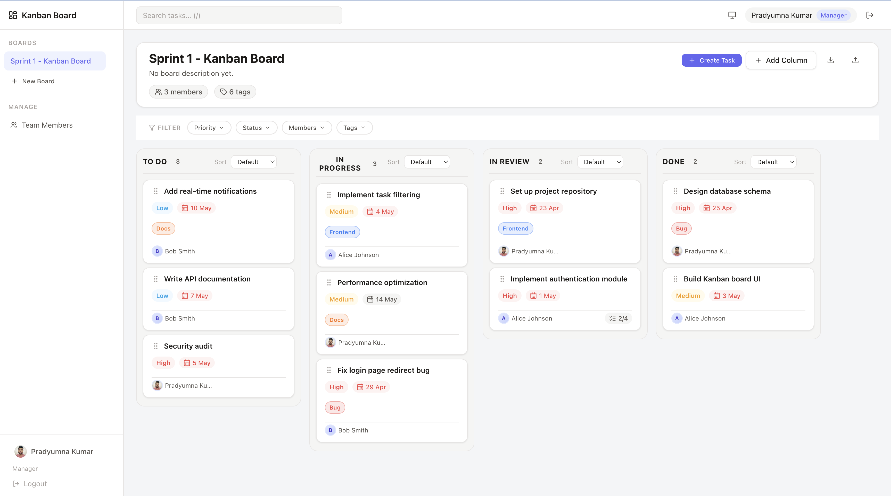
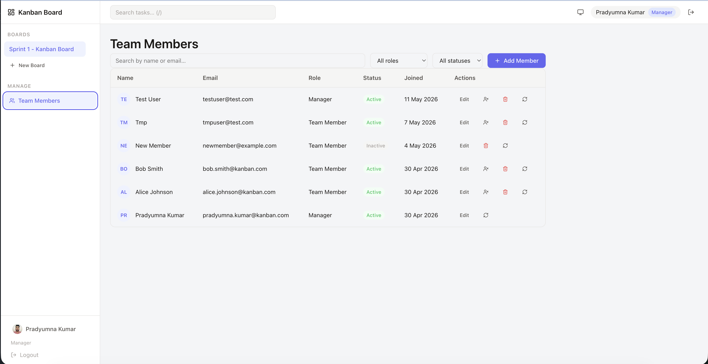
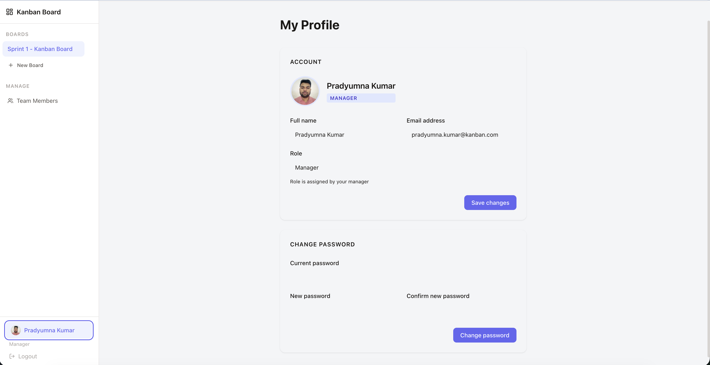

<h1 align="center">🗂️ Kanban Task Board</h1>

<p align="center">
  A production-quality Kanban project tracking application built with React 19, TypeScript, and Vite —
  no UI libraries, no drag-and-drop libraries, and no CSS frameworks. Every component is hand-crafted.
</p>

<p align="center">
  
  
  
  
  
</p>

---

## 📋 Table of Contents

- [Overview](#-overview)
- [Tech Stack](#-tech-stack)
- [Features](#-features)
- [Screenshots](#-screenshots)
- [Getting Started](#-getting-started)
- [Environment Variables](#-environment-variables)
- [Folder Structure](#-folder-structure)
- [Custom Hooks](#-custom-hooks)
- [Keyboard Shortcuts](#-keyboard-shortcuts)
- [Testing](#-testing)
- [Mock vs Real API](#-mock-vs-real-api)
- [One Thing I Found Difficult](#-one-thing-i-found-difficult)
- [Architecture Notes](#-architecture-notes)
- [Future Improvements](#-future-improvements)
- [Author](#-author)
- [License](#-license)

---

## 🌟 Overview

Kanban Task Board is a feature-complete project management app inspired by Linear, Trello, and Asana. It supports multiple boards with configurable columns, rich task management (priorities, tags, checklists, assignees, due dates), team collaboration with role-based access control, and a fully custom drag-and-drop system — all built from scratch without any third-party UI, DnD, or CSS library.

**Key highlights:**
- 🔐 JWT authentication with silent refresh — no re-login on token expiry
- 🎭 Two roles — Manager (full control) and Team Member (own tasks only)
- 🖱️ Native HTML5 Drag and Drop with custom ghost, drop animations, and lock indicators
- 🏷️ Dynamic board-level tags with full attach/detach support
- ↩️ Undo / Redo for the last 20 actions
- 🌗 Light / Dark / System theme with smooth CSS variable transitions
- 📱 Offline indicator — app stays functional with cached data
- 📤 Full board import and export as JSON

---

## 🛠️ Tech Stack

| Technology | Purpose |
|---|---|
| [React 19](https://react.dev) | UI framework |
| [TypeScript](https://www.typescriptlang.org/) | Strict type safety (`strict: true`, zero `any`) |
| [Vite](https://vitejs.dev) | Build tool and dev server |
| React Context + `useReducer` | Global state management (no Redux or Zustand) |
| Native HTML5 Drag and Drop API | Drag-and-drop (no library) |
| CSS Variables | Design tokens, theming, and all styling (no Tailwind or CSS-in-JS) |
| [Vitest](https://vitest.dev) | Unit testing |
| [ESLint](https://eslint.org) + [Prettier](https://prettier.io) | Code quality and formatting |

---

## ✨ Features

### 🔐 Authentication
- Email + password login with JWT access tokens (15 min) and refresh tokens (7 days)
- Silent token refresh — expired access tokens are renewed automatically
- Role-based access control: **Manager** and **Team Member**
- Protected routes — unauthenticated users redirected to `/login`
- Forced logout after double 401 (refresh also expired)

### 📋 Board Management
- Create, rename, and delete multiple boards
- Switch between boards from the sidebar
- Per-board tag library — tags are scoped to their board
- Board members — Manager can add or remove team members per board

### 🎯 Task Management
- Full CRUD: title, description (markdown), priority (low / medium / high), due date, assignee, tags, checklist
- Inline title editing directly on the card — no popup needed
- Lazy-loaded task detail `<dialog>` for full editing with form validation
- Archive / unarchive tasks without permanent deletion
- Automatic `createdAt` / `updatedAt` tracking

### 🖱️ Drag and Drop
- Drag tasks between columns and reorder within a column
- Drag columns to reorder the board layout
- Custom drag ghost: shadow lift, scale, and 2° rotation
- Drop-zone highlight with smooth easing into final position
- Team Members cannot drag tasks they don't own — lock icon with tooltip

### 🏷️ Tag Management
- Create and colour board tags (Manager only)
- Attach / remove tags on any task from the task detail or task card
- Filter the board by one or more tags

### ✅ Checklist
- Add, complete, and delete sub-items per task
- Progress bar shown on the task card

### 👥 User Management *(Manager only)*
- Create team members with name, email, role, and password
- Password strength indicator
- Edit member details and deactivate members (soft delete — data preserved)
- One-click password reset with copyable temporary password

### 🔎 Search and Filtering
- Debounced search (300 ms) across task title and description
- Filter by: priority, tag, assignee, due-date range, overdue-only
- Per-column sort: priority, due date, or manual order

### ↩️ Undo / Redo
- Last 20 actions undoable: move, delete, edit task
- `Ctrl+Z` / `Ctrl+Shift+Z`

### 🎨 Theming and Accessibility
- Light / Dark / System theme — smooth CSS variable swap, no flash
- 9-step colour scale per semantic role (primary, gray, danger, warning, success, info)
- `prefers-reduced-motion` — animations disabled when requested
- Full keyboard navigation, focus trap in dialogs, ARIA roles, WCAG AA contrast

### 🌐 Offline and Import/Export
- `navigator.onLine` banner — app stays functional with cached data
- Export board as JSON, import to restore

### 👤 Profile
- Edit display name, email, and avatar
- Change password with strength indicator

---

## 📸 Screenshots

<h3>Kanban Board</h3>


<br/>

<h3>Team Members</h3>


<br/>

<h3>My Profile</h3>


---

## 🚀 Getting Started

### Prerequisites

- **Node.js** ≥ 20
- **npm** ≥ 10

### Install and Run

```bash
npm install
npm run dev          # → http://localhost:5173
npm run build        # TypeScript check + Vite production build
npm run lint         # ESLint — must exit with 0 warnings
npm test             # Vitest — 44 tests
npm run format:check # Prettier check
```

**Default mock credentials** (when `VITE_USE_MOCK=true`):

| Role | Email | Password |
|---|---|---|
| Manager | `manager@test.com` | `Manager@123` |
| Team Member | `member@test.com` | `Member@123` |

---

## ⚙️ Environment Variables

Create a `.env.local` file in the project root:

```env
# Set to true to run entirely offline with the localStorage mock (default for development)
VITE_USE_MOCK=true

# Backend base URL — set to your backend server or ngrok URL
VITE_API_BASE_URL=http://localhost:3000
```

> When `VITE_USE_MOCK=true`, all API calls are handled by a localStorage-backed mock client with an identical interface. No backend is needed. Switch to real backend by setting `VITE_USE_MOCK=false` — zero component changes required.

---

## 📁 Folder Structure

```
src/
├── components/
│   ├── auth/               # ProtectedRoute, RoleGuard
│   ├── board/              # Column, TaskCard, FilterBar, TagPicker,
│   │                       #   CreateTaskModal, ManageTagsModal, BoardMembersModal
│   ├── layout/             # AppLayout, Header, Sidebar
│   └── ui/                 # Button, Badge, Skeleton, Toast,
│                           #   EmptyState, ConfirmModal, ErrorBoundary
├── context/
│   ├── AuthContext.tsx     # JWT auth — login, logout, silent refresh
│   ├── BoardContext.tsx    # Board + task state (useReducer + undo/redo)
│   ├── DragContext.tsx     # In-flight drag-state tracking
│   ├── FilterContext.tsx   # Per-board filter state
│   ├── SearchContext.tsx   # Debounced search + dialog state
│   ├── ThemeContext.tsx    # light / dark / system theme
│   └── ToastContext.tsx    # Toast notification queue
├── hooks/
│   ├── useDebounce.ts      # Generic debounce — used for search (300 ms)
│   ├── useKeyboardShortcut.ts
│   ├── useLocalStorage.ts  # Versioned, type-safe localStorage persistence
│   ├── usePermissions.ts   # Role-based permission checks (single source of truth)
│   └── useUndoRedo.ts      # Generic undo/redo stack, capped at 20 entries
├── pages/
│   ├── BoardPage.tsx
│   ├── LoginPage.tsx
│   ├── NotAuthorizedPage.tsx
│   ├── ProfilePage.tsx
│   ├── TaskDetail.tsx      # Lazy-loaded task detail <dialog>
│   └── UsersPage.tsx       # Manager-only user management
├── styles/
│   ├── tokens.css          # ALL design tokens: colours (9-step scale), spacing,
│   ├── tokens.dark.css     #   typography, radii, shadows — light + dark themes
│   ├── global.css          # Reset, base styles, prefers-reduced-motion
│   ├── board/              # Column.css, Column.drop.css, TaskCard.css,
│   │                       #   TaskCard.detail.css, FilterBar.css, FilterBar.dropdown.css
│   ├── components/         # Button.css, Badge.css, Toast.css, Skeleton.css,
│   │                       #   TagPicker.css, ManageTagsModal.css, BoardMembersModal.css …
│   ├── layout/             # AppLayout.css, Header.css, Sidebar.css, Sidebar.nav.css
│   └── pages/              # BoardPage.css, TaskDetail.css, TaskDetail.form.css,
│                           #   TaskDetail.checklist.css, UsersPage.css, ProfilePage.css …
├── test/
│   ├── boardReducer.test.ts
│   ├── useDebounce.test.ts
│   ├── useKeyboardShortcut.test.ts
│   ├── useLocalStorage.test.ts
│   └── useUndoRedo.test.ts
├── types/
│   ├── actions.ts          # Discriminated union BoardAction
│   ├── api.ts              # API response envelope shapes
│   ├── auth.ts
│   ├── entities.ts         # Board, Column, Task, User, Tag + type guards
│   └── index.ts
└── utils/
    ├── adapters.ts         # Raw API → domain type transformers
    ├── api.ts              # Single import point: switches mock ↔ real by env flag
    ├── apiClient.ts        # Real fetch wrapper (JWT, ngrok header, silent refresh)
    ├── mockApiClient.ts    # localStorage-backed mock — identical API shape
    ├── storage.ts          # Versioned localStorage read/write with migration support
    └── tokenStore.ts       # In-memory JWT access-token store
```

---

## 🪝 Custom Hooks

| Hook | Description |
|---|---|
| `useLocalStorage<T>` | Reads and writes versioned, type-safe values to localStorage. Accepts a `version` and optional `migrate` function so persisted data survives schema changes. |
| `useDebounce<T>` | Returns a debounced copy of any value. Used for the search input (300 ms). Generic and reusable anywhere rapid state changes should not trigger expensive work. |
| `useUndoRedo<T>` | Generic undo/redo stack capped at 20 entries. Stacks live in `useRef` (no re-render on push/pop); separate `useState` flags drive reactive `canUndo`/`canRedo` UI. |
| `useKeyboardShortcut` | Attaches a `keydown` listener for a key + modifier combination. Automatically skips when focus is inside `<input>`, `<textarea>`, or `[contenteditable]`. |
| `usePermissions` | Single source of truth for role-based UI gates. Exposes `canEditTask(task)`, `canDragTask(task)`, `canDeleteTask(task)`, `canReassign(task)`, `canManageUsers`. No scattered `role === 'MANAGER'` checks in components. |

---

## ⌨️ Keyboard Shortcuts

| Key | Action |
|---|---|
| `N` | Open "Add task" form in the first column |
| `/` | Focus the global search input |
| `↑ / ↓` | Move focus up / down within the current column |
| `← / →` | Move focus to the same-index task in the adjacent column |
| `Enter` or `Space` | Open task detail popup when a card is focused |
| `Esc` | Close any open popup or dialog |
| `Ctrl + Z` | Undo the last action (move, delete, or edit task) |
| `Ctrl + Shift + Z` | Redo |
| `Ctrl + Y` | Redo (alternative) |

---

## 🧪 Testing

```bash
npm test               # watch mode
npm run test -- --run  # CI mode (single run, 44 tests)
```

| Suite | Tests | Coverage |
|---|---|---|
| `boardReducer.test.ts` | 22 | Board/Column/Task CRUD, MOVE_TASK, tag ops, loading/error state |
| `useUndoRedo.test.ts` | 7 | push, undo, redo, history cap, state isolation |
| `useLocalStorage.test.ts` | 6 | read, write, versioning, migration, SSR safety |
| `useKeyboardShortcut.test.ts` | 5 | key binding, modifier keys, skip-inside-input |
| `useDebounce.test.ts` | 4 | delay, immediate value, cleanup on unmount |

---

## 🔀 Mock vs Real API

All network calls go through `src/utils/api.ts` — a one-line switch:

```env
# .env.local — localStorage-backed mock (default for development, no backend needed)
VITE_USE_MOCK=true

# .env.local — real backend via ngrok or localhost
VITE_USE_MOCK=false
VITE_API_BASE_URL=https://your-ngrok-url.ngrok-free.app
```

`mockApiClient.ts` and `apiClient.ts` export **identical function signatures**. Switching requires only the env flag — zero component changes.

The real API client (`apiClient.ts`):
- Prepends `VITE_API_BASE_URL` to every request
- Adds `Authorization: Bearer <token>` and `ngrok-skip-browser-warning: true` headers
- On 401, attempts one silent token refresh then forces logout
- Supports `AbortController` via a `signal` option for request cancellation

---

## 🏛️ Architecture Notes

- **Auth:** Access token is stored in memory (`tokenStore.ts`) — not accessible to injected JS. Refresh token is in `localStorage` (tradeoff: httpOnly cookies require server-side config not yet supported by the backend). On 401, the API client attempts one silent refresh; a second 401 triggers `forceLogout`.
- **State:** Board data in `BoardContext` (`useReducer`). Theme in `ThemeContext`. Auth in `AuthContext`. No external state library.
- **CSS design system:** All colours are CSS variables in `styles/tokens.css` using a 9-step scale (50–900) for each semantic role (primary, gray, danger, warning, success, info). No hardcoded hex values in component CSS. Dark-theme overrides live in `tokens.dark.css`. Themes switch by toggling a class on `<html>`.
- **Offline:** `navigator.onLine` + `online`/`offline` events drive the offline banner. The board stays usable with cached data.
- **Container queries:** `board-column__body` has `container-type: inline-size`. Task cards use `@container task-column` rules to adapt at narrow (< 220 px) and wide (> 400 px) column widths.
- **Animations:** Entrances use `cubic-bezier(0.16, 1, 0.3, 1)`. `prefers-reduced-motion: reduce` disables keyframe animations globally via a single media query in `global.css`.

---

## 🔮 Future Improvements

- 📱 **Mobile swipe** — single-column-at-a-time view with horizontal touch swipe
- 🔔 **Real-time notifications** — WebSocket live updates for task moves and assignments
- 📊 **Activity log UI** — visible audit trail per board
- 📎 **File attachments** — images and documents on tasks
- 🗓️ **Timeline / Calendar view** — Gantt-style deadline management
- 🧩 **Board templates** — pre-built column layouts (Scrum, Bug Tracker, etc.)
- 📤 **CSV Export** — export task list to spreadsheet
- 🔐 **OAuth** — sign in with Google or GitHub

---

## 👤 Author

**Pradyumna Kumar**

---